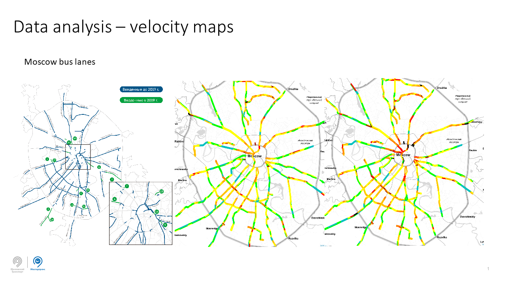

[](https://travis-ci.com/MobilityDB/MobilityDB) [](https://coveralls.io/github/MobilityDB/MobilityDB?branch=develop) [](https://www.codacy.com/gh/MobilityDB/MobilityDB?utm_source=github.com&amp;utm_medium=referral&amp;utm_content=MobilityDB/MobilityDB&amp;utm_campaign=Badge_Grade)  [](https://gitter.im/MobilityDBProject/MobilityDB?utm_source=badge&utm_medium=badge&utm_campaign=pr-badge)

MobilityDB
==========
An open source geospatial trajectory data management & analysis platform


MobilityDB is a database management system for moving object geospatial trajectories, such as GPS traces. It adds support for temporal and spatio-temporal objects to the [PostgreSQL](https://www.postgresql.org/) database and its spatial extension [PostGIS](http://postgis.net/).

MobilityDB is developed by the Computer & Decision Engineering Department of the [Université Libre de Bruxelles](https://www.ulb.be/) (ULB) under the direction of [Prof. Esteban Zimányi](http://cs.ulb.ac.be/members/esteban/). ULB is an OGC Associate Member and member of the OGC Moving Feature Standard Working Group ([MF-SWG](https://www.ogc.org/projects/groups/movfeatswg)). 


The MobilityDB project is managed by a [steering committee](https://github.com/MobilityDB/MobilityDB/wiki/MobilityDB-Project-Steering-Committe).

Benefits
--------
*   Compact geospatial trajectory data storage
*   Rich mobility analytics
*   Big data scale and performance
*   Easy to use full SQL interface
*   Compatible with the PostgreSQL ecosystem 
*   Compliant with the [Moving Features](https://www.opengeospatial.org/standards/movingfeatures) standards from the [Open Geospatial Consortium](https://www.opengeospatial.org/) (OGC).
*   Database adapters to access MobilityDB from Python are also available
    *    [MobilityDB-python](https://github.com/MobilityDB/MobilityDB-python) supports both the [psycopg2](https://www.psycopg.org/) and the [asyncpg](https://github.com/MagicStack/asyncpg) adapters for PostgreSQL and uses the [postgis](https://github.com/tilery/python-postgis) adapter for PostGIS. This package is developed by the MobilityDB Team.
    *    [MobilityDB SQLAlchemy](https://github.com/adonmo/mobilitydb-sqlalchemy) is another independent package that provides extensions to [SQLAlchemy](https://www.sqlalchemy.org/) for interacting with MobilityDB.

Branches
--------

*   The *master* branch has the latest release
*   The *develop* branch has the development of the next release.
The complete list of releases is available [here](https://github.com/MobilityDB/MobilityDB/releases)

Status
------
The extension is under development. We are planning to release the first version at the end of 2020.

Requirements
------------

*   Linux (other UNIX-like systems may work, but remain untested)
*   PostgreSQL > 10
*   CMake >= 3.1
*   PostGIS == 2.5
*   JSON-C
*   GNU Scientific Library (GSL)
*   Development files for PostgreSQL, PostGIS/liblwgeom, PROJ & JSON-C

For example, you can build the following command to install all MobilityDB build dependencies for Debian-based systems:
```bash
apt install build-essential cmake postgresql-server-dev-11 liblwgeom-dev libproj-dev libjson-c-dev
```

Building & Installation
-----------------------
Here is the gist:
```bash
git clone https://github.com/MobilityDB/MobilityDB
mkdir MobilityDB/build
cd MobilityDB/build
cmake ..
make
sudo make install
psql -c 'CREATE EXTENSION MobilityDB CASCADE'
```

You should also set the following in postgresql.conf:
```bash
shared_preload_libraries = 'postgis-2.5'
max_locks_per_transaction = 128
```

Docker Container
-----------------

Docker containers with MobilityDB and all its dependencies are available [here](https://github.com/MobilityDB/MobilityDB-docker). These images are based on the official [Postgres](https://github.com/docker-library/postgres) and [Postgis](https://github.com/postgis/docker-postgis) docker images, please refer to them for more information.

If you have docker installed in your system you can run:
```bash
docker pull codewit/mobilitydb
docker volume create mobilitydb_data
docker run --name "mobilitydb" -d -p 25432:5432 -v mobilitydb_data:/var/lib/postgresql codewit/mobilitydb
```
The first command is to download the latest most up-to-date image of MobilityDB. The second command creates a volume container on the host, that we will use to persist the PostgreSQL database files outside of the MobilityDB container. The third command executes this binary image of PostgreSQL, PostGIS, and MobilityDB with the TCP port 5432 in the container mapped to port 25432 on the Docker host (user = pw = docker, db = mobilitydb). 

Issues
------

Please report any [issues](https://github.com/MobilityDB/MobilityDB/issues) you may have

Documentation
-------------

### User's Manual

If you are in the `doc` directory of MobilityDB you can generate the user's manual from the sources as follows:

*   HTML
    ```bash
    xsltproc --stringparam html.stylesheet "docbook.css" --xinclude -o index.html /usr/share/xml/docbook/stylesheet/docbook-xsl/html/chunk.xsl mobilitydb-manual.xml
    ```
*   PDF
    ```bash
    dblatex -s texstyle.sty mobilitydb-manual.xml
    ```
*   EPUB
    ```bash
    dbtoepub -o mobilitydb-manual.epub mobilitydb-manual.xml
    ```

In addition, pregenerated versions of them are available.

*   [HTML](https://docs.mobilitydb.com/MobilityDB/develop/)
*   [PDF](https://docs.mobilitydb.com/MobilityDB/develop/mobilitydb-manual.pdf)
*   [EPUB](https://docs.mobilitydb.com/MobilityDB/develop/mobilitydb-manual.epub)

### Developer's Documentation

If you are in the root directory of MobilityDB you can generate the developer's documentation from the source files as follows:
```bash
doxygen Doxyfile
```

The resulting HTML documentation will be generated in the `docs` directory of MobilityDB.

In addition, a pregenerated version of the documentation is available.

*   [HTML](https://docs.mobilitydb.com/MobilityDB/develop/api/html)

### Publications

*   Anita Graser, Esteban Zimányi, Krishna Chaitanya Bommakanti, [From Simple Features to Moving Features and Beyond?](https://arxiv.org/abs/2006.16900), arXiv 2006.16900, 2020.
*   Esteban Zimányi, Mahmoud Sakr, Arthur Lesuisse, MobilityDB: A Mobility Database based on PostgreSQL and PostGIS. To appear in ACM Transactions on Database Systems, 2020.
*   Mohamed Bakli, Mahmoud Sakr, Esteban Zimányi, [Distributed Mobility Data Management in
MobilityDB](https://docs.mobilitydb.com/pub/MobilityDBDemo_MDM2020.pdf). In Proc. of the 21st IEEE International Conference on
Mobile Data Management, MDM 2020.
*   Mohamed Bakli, Mahmoud Sakr, Esteban Zimányi, [Distributed Moving Object Data Management in MobilityDB](https://docs.mobilitydb.com/pub/DistMobilityDB_BigSpatial19.pdf). In Proc. of the 8th ACM SIGSPATIAL International Workshop on Analytics for Big Geospatial Data, BigSpatial 2019. [Slides](https://docs.mobilitydb.com/pub/DistributedMobilityDB_BigSpatial19_Slides.pdf).
*   Esteban Zimányi, Mahmoud Sakr, Arthur Lesuisse, Mohamed Bakli, [MobilityDB: A Mainstream Moving Object Database System](https://docs.mobilitydb.com/pub/MobilityDBDemo_SSTD19.pdf). In [Proc. of the 16th International Symposium on Spatial and Temporal Databases, SSTD 2019, p. 206-209](https://dl.acm.org/citation.cfm?id=3340991). ACM. [Best Demo Paper Award](https://docs.mobilitydb.com/pub/MobilityDBDemo_SSTD19_BDPA.pdf). [Poster](https://docs.mobilitydb.com/pub/MobilityDBDemo_SSTD19_Poster.pdf)
*   Alejandro A. Vaisman, Esteban Zimányi:
[Mobility Data Warehouses](https://docs.mobilitydb.com/pub/MobilityDW_IJGI19.pdf). [ISPRS International Journal of Geo-Information, 8(4): 170, 2019](https://www.mdpi.com/2220-9964/8/4/170).

### Presentations

*   [A Moving Feature Data Generator in MobilityDB](https://docs.mobilitydb.com/pub/MobilityDB-OGC-2020-June-slides.pdf), Talk given in the 115th OGC Member Meeting, in the Moving Features Standard Working Group meeting, June 19th 2020. [Video](https://docs.mobilitydb.com/pub/MobilityDB-OGC-2020-June-video.mp4)
*   [MobilityDB: Managing Mobility Data in PostgreSQL](https://docs.mobilitydb.com/pub/MobilityDB-BMDA2020.pdf), Keynote speach at the joint EDBT/ICDT 2020 workshop on Big Mobility Data Analytics, [BMDA 2020](http://www.datastories.org/bmda20/BMDA20Invites.html), March 30, 2020, Copenhagen, Denmark. [Video](https://docs.mobilitydb.com/pub/MobilityDB-BMDA2020.mp4)
*   [Extending PostgreSQL With Spatiotemporal Data Management](https://docs.mobilitydb.com/pub/MobilityDB-Russia-2020.pdf), [PGConf.Russia](https://pgconf.ru/en/2020/264545), February 4, 2020, Moscow, Russia
*   [Road public transport in Moscow analysis: from PostGIS to MobilityDB](https://docs.mobilitydb.com/pub/MoscowPublicTransport_MobilityDB_en.pdf), [PGConf.Russia](https://pgconf.ru/en/2020/265266), February 4, 2020, Moscow, Russia,
*   [Managing Mobility Data in PostgreSQL](https://docs.mobilitydb.com/pub/MobilityDB-PGDay-2020.pdf), [FOSSDEM PGDay](https://www.postgresql.eu/events/fosdem2020/schedule/session/2864-managing-mobility-data-in-postgresql/), January 31, 2020, Brussels, Belgium
*   [Trajectory Data Analysis Using MobilityDB](https://docs.mobilitydb.com/pub/MobilityDB-FOSDEM-2020.pdf), [FOSSDEM GeoSpatial Devroom](https://fosdem.org/2020/schedule/event/mobilitydb/), February 2, 2020, Brussels, Belgium
*   [MobilityDB: A PostgreSQL-PostGIS extension for mobility data management](https://docs.mobilitydb.com/pub/MobilityDB_FOSS4G_Brussels_2019.pdf), [FOSS4G Belgium](https://2019.foss4g.be/en/programme.php), 2019.
*   [MobilityDB: A PostgreSQL extension for mobility data management](https://docs.mobilitydb.com/pub/MobilityDB_PgConf_Russia_2019.pdf), [PGConf.Russia](https://pgconf.ru/en/2019/242944), 2019.

Users' Applications
-------------------

*   Nina Belyavskaya works at Mosgortrans Mobility Department, whose mission to optimize road public transport routes and timetables in Moscow, Russia. She reported her experience of migrating from PostGIS to MobilityDB in [PGConf.Russia 2020](https://pgconf.ru/en/2020/265266)

    
*   Bommakanti Krishna Chaitanya works at [Adonmo](https://www.adonmo.com/), a company specialized in digital taxi-top advertising. He reported his experience on using MobilityDB together with SQLAlchemy [here](https://anitagraser.com/2020/03/02/movement-data-in-gis-29-power-your-web-apps-with-movement-data-using-mobilitydb-sqlalchemy/)

    
*   Florian Nadler works at [Cybertec](https://www.cybertec-postgresql.com/en/), a company specialized on Data Science using PostgreSQL. He reported his experience on using MobilityDB for intersecting tracks of persons in the context of the Covid pandemic [here](https://www.cybertec-postgresql.com/en/intersecting-tracks-of-individuals-mobilitydb/)

    
Let us know how you use MobilityDB in your applications to report it here.

Licenses
--------
*   MobilityDB code is provided under the [PostgreSQL License](https://github.com/MobilityDB/MobilityDB/blob/master/LICENSE.txt).
*   MobilityDB documentation is provided under the [Creative Commons Attribution-Share Alike 3.0 License 3](https://creativecommons.org/licenses/by-sa/3.0/).
