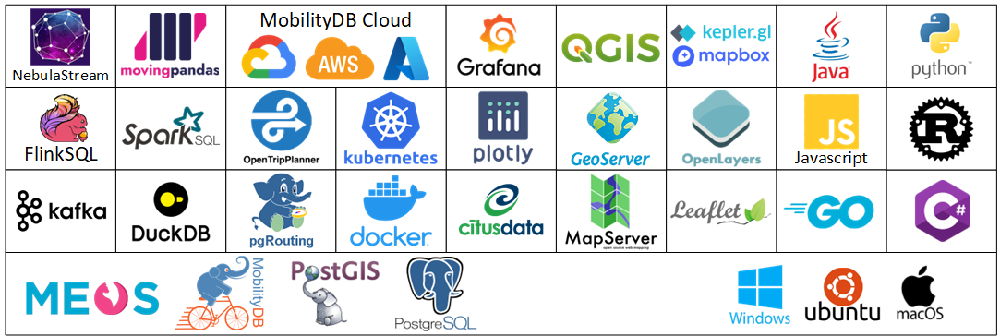

[](https://coveralls.io/github/MobilityDB/MobilityDB?branch=develop)
[](https://www.codacy.com/gh/MobilityDB/MobilityDB?utm_source=github.com&amp;utm_medium=referral&amp;utm_content=MobilityDB/MobilityDB&amp;utm_campaign=Badge_Grade)
[](https://gitter.im/MobilityDBProject/MobilityDB?utm_source=badge&utm_medium=badge&utm_campaign=pr-badge)

MobilityDB
==========
An open source geospatial trajectory data management & analysis platform


MobilityDB is a database management system for moving object geospatial trajectories, such as GPS traces. It adds support for temporal and spatio-temporal objects to the [PostgreSQL](https://www.postgresql.org/) database and its spatial extension [PostGIS](http://postgis.net/).

MobilityDB is developed by the Computer & Decision Engineering Department of the [Université libre de Bruxelles](https://www.ulb.be/) (ULB) under the direction of [Prof. Esteban Zimányi](http://cs.ulb.ac.be/members/esteban/). ULB is an OGC Associate Member and member of the OGC Moving Feature Standard Working Group ([MF-SWG](https://www.ogc.org/projects/groups/movfeatswg)).


The MobilityDB project is managed by a [steering committee](https://github.com/MobilityDB/MobilityDB/wiki/MobilityDB-Project-Steering-Committe).

More information about MobilityDB, including publications, presentations, etc., can be found in the MobilityDB [website](https://mobilitydb.com).

Benefits
--------

*   Compact geospatial trajectory data storage

*   Rich mobility analytics

*   Big data scale and performance

*   Easy to use full SQL interface

*   Compatible with the PostgreSQL ecosystem

    

*   Compliant with the [Moving Features](https://www.opengeospatial.org/standards/movingfeatures) standards from the [Open Geospatial Consortium](https://www.opengeospatial.org/) (OGC)

*   Adopted by the [Open Source Geospatial Foundation](https://www.osgeo.org/) (OSGeo) as a [community project](https://www.osgeo.org/projects/mobilitydb/)

*   Database adapters to access MobilityDB from Python are also available

    *   [MobilityDB-python](https://github.com/MobilityDB/MobilityDB-python) supports both the [psycopg2](https://www.psycopg.org/) and the [asyncpg](https://github.com/MagicStack/asyncpg) adapters for PostgreSQL and uses the [postgis](https://github.com/tilery/python-postgis) adapter for PostGIS. This package is developed by the MobilityDB Team.
    *   [MobilityDB SQLAlchemy](https://github.com/adonmo/mobilitydb-sqlalchemy) is another independent package that provides extensions to [SQLAlchemy](https://www.sqlalchemy.org/) for interacting with MobilityDB

*   Data generator and benchmark tool based on the [BerlinMOD](http://dna.fernuni-hagen.de/secondo/BerlinMOD/BerlinMOD.html) benchmark. The data generator takes input data from [Open Street Map](https://www.openstreetmap.org/) and uses [pgRouting](https://pgrouting.org/) to generate routes between pairs of source and target locations.

    *   [MobilityDB-BerlinMOD](https://github.com/MobilityDB/MobilityDB-BerlinMOD)

*   [Plugin](https://github.com/mschoema/move) to display the result of MobilityDB queries in [QGIS](https://qgis.org/)

*   An extensive [workshop](https://github.com/MobilityDB/MobilityDB-workshop) illustrating various usage scenarios of MobilityDB

Experimental Projects
-----------------------------

These projects push the boundaries of MobilityDB and connect it with the PostgreSQL/PostGIS ecosystem.

*   [MobilityDB-AWS](https://github.com/MobilityDB/MobilityDB-AWS): MobilityDB on Amazon Web Services
*   [MobilityDB-Azure](https://github.com/JimTsesm/MobilityDB-Azure): MobilityDB on Azure
*   [MobilityDB-Deck](https://github.com/MobilityDB/MobilityDB-Deck) Integration of MobilityDB with the data visualization framework Deck.gl
*   [MobilityDB-QGIS](https://github.com/MobilityDB/MobilityDB-QGIS): Integration of MobilityDB with QGIS

Mailing Lists
------------

There are two mailing lists for MobilityDB hosted on OSGeo mailing list server:

*   User mailing list: https://lists.osgeo.org/mailman/listinfo/mobilitydb-users
*   Developer mailing list: https://lists.osgeo.org/mailman/listinfo/mobilitydb-dev

For general questions and topics about how to use MobilityDB, please write to the user mailing list.

Branches
--------

*   The `master` branch has the latest release
*   The `develop` branch has the development of the next release. The complete list of releases is available [here](https://github.com/MobilityDB/MobilityDB/releases)

Status
------

The current version is 1.0. We are planning to release version 1.1 in the summer of 2023.

Requirements
------------

*   Linux (other UNIX-like systems may work, but remain untested)
*   PostgreSQL >= 12
*   CMake >= 3.7
*   PostGIS >= 3.0
*   JSON-C
*   GNU Scientific Library (GSL)
*   Development files for PostgreSQL, PostGIS, PROJ, JSON-C

For example, you can build the following command to install all MobilityDB build dependencies for Debian-based systems using PostgreSQL 14 and PostGIS 3:
```bash
apt install build-essential cmake postgresql-server-dev-14 libproj-dev libjson-c-dev
```

Building & Installation
-----------------------

Here is the gist:
```bash
git clone https://github.com/MobilityDB/MobilityDB
mkdir MobilityDB/build
cd MobilityDB/build
cmake ..
make
sudo make install
```
The above commands install the `master` branch. If you want to install another branch, for example, `develop`, you can replace the first command above as follows
```bash
git clone --branch develop https://github.com/MobilityDB/MobilityDB
```
You should also set the following in `postgresql.conf` depending on the version of PostGIS you have installed (below we use PostGIS 3):
```bash
shared_preload_libraries = 'postgis-3'
max_locks_per_transaction = 128
```
You can replace `postgis-2.5` above if you want to use PostGIS 2.5.

If you do not preload the PostGIS library you will not be able to load the MobilityDB library and will get an error message such as the following one
```bash
ERROR:  could not load library "/usr/local/pgsql/lib/libMobilityDB-1.0.so": undefined symbol: ST_Distance
```

Notice that you can find the location of the `postgresql.conf` file as given next:
```bash
$ which postgres
/usr/local/pgsql/bin/postgres
$ ls /usr/local/pgsql/data/postgresql.conf
/usr/local/pgsql/data/postgresql.conf
```
As can be seen, the PostgreSQL binaries are in the `bin` subdirectory while the `postgresql.conf` file is in the `data` subdirectory.

Once MobilityDB is installed, it needs to be enabled in each database you want to use it in. In the example below we use a database named `mobility`.
```bash
createdb mobility
psql mobility -c "CREATE EXTENSION PostGIS"
psql mobility -c "CREATE EXTENSION MobilityDB"
```

Docker Container
-----------------

Docker containers with MobilityDB and all its dependencies are available [here](https://github.com/MobilityDB/MobilityDB-docker). These images are based on the official [Postgres](https://github.com/docker-library/postgres) and [Postgis](https://github.com/postgis/docker-postgis) docker images, please refer to them for more information.

If you have docker installed in your system you can run:
```bash
docker pull mobilitydb/mobilitydb
docker volume create mobilitydb_data
docker run --name "mobilitydb" -d -p 25432:5432 -v mobilitydb_data:/var/lib/postgresql mobilitydb/mobilitydb
psql -h localhost -p 25432 -d mobilitydb -U docker
```
The first command is to download the latest most up-to-date image of MobilityDB. The second command creates a volume container on the host, that we will use to persist the PostgreSQL database files outside of the MobilityDB container. The third command executes this binary image of PostgreSQL, PostGIS, and MobilityDB with the TCP port 5432 in the container mapped to port 25432 on the Docker host (user = pw = docker, db = mobilitydb). The fourth command is to connect to the database using psql.

Issues
------

Please report any [issues](https://github.com/MobilityDB/MobilityDB/issues) you may have.

Documentation
-------------

### User's Manual

You can generate the user's manual in HTML, PDF, and EPUB formats. The manual is generated in English and in other available languages (currently only Spanish). For this, it is necessary to specify appropriate options in the `cmake` command as follows:

*   `DOC_ALL`: Generate in HTML, PDF, and EPUB formats
*   `DOC_HTML`: Generate in HTML format
*   `DOC_PDF`: Generate in PDF format
*   `DOC_EPUB`: Generate in EPUB format
*   `LANG_ALL`: Generate in all available languages
*   `ES`: Generate the Spanish documentation

For example, the following command generates the documentation in all formats and in all languages.
```bash
cmake -D DOC_ALL=true -D LANG_ALL=true ..
make doc
```
As another example, the following command generates the English documentation in PDF.
```bash
cmake -D DOC_PDF=true ..
make doc
```
The resulting documentation will be generated in the `doc` directory of the build directory.

In addition, pregenerated versions of them are available.

*   [HTML](https://docs.mobilitydb.com/MobilityDB/develop/)
*   [PDF](https://docs.mobilitydb.com/MobilityDB/develop/mobilitydb-manual.pdf)
*   [EPUB](https://docs.mobilitydb.com/MobilityDB/develop/mobilitydb-manual.epub)

The documentation is also avaible in Spanish.

*   [HTML](https://docs.mobilitydb.com/MobilityDB/develop/es/)
*   [PDF](https://docs.mobilitydb.com/MobilityDB/develop/es/mobilitydb-manual.pdf)
*   [EPUB](https://docs.mobilitydb.com/MobilityDB/develop/es/mobilitydb-manual.epub)

### Developer's Documentation

You can generate the English developer's documentation in HTML format. For this, it is necessary to the option `DOC_DEV` in the `cmake` command as follows:

```bash
cmake -D DOC_DEV=true ..
make doc_dev
```

The resulting HTML documentation will be generated in the `doxygen` directory of the build directory.

In addition, a pregenerated version of the documentation is available.

*   [HTML](https://docs.mobilitydb.com/MobilityDB/develop/api/html)

Licenses
--------

*   MobilityDB code is provided under the [PostgreSQL License](https://github.com/MobilityDB/MobilityDB/blob/master/LICENSE.txt).
*   MobilityDB documentation is provided under the [Creative Commons Attribution-Share Alike 3.0 License 3](https://creativecommons.org/licenses/by-sa/3.0/).
